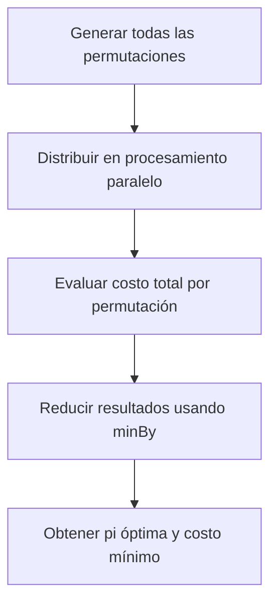

# Proyecto Final – Programación Funcional y Concurrente
## Informe 4
### Permutaciones Paralelas y Óptimo Global Paralelo

*Integrante:* JUAN DAVID ASCENCIO CANCMANCE  
*Código:* 202359660  
*Correo:* juandavid.ascencio@correounivalle.edu.co

---

# 1. RESPONSABILIDADES

- Implementación paralela de:
    - `generarProgramacionesRiegoPar`
    - `ProgramacionRiegoOptimoPar`
- Diseño de la estrategia de paralelización de exploración total.
- Integración con funciones secuenciales del proyecto.
- Validación con suite de pruebas paralelas.
- Benchmark final de optimización secuencial vs paralela.
- Análisis según la Ley de Amdahl.
- Redacción de conclusiones globales del proyecto.

---

# 2. FUNCIONES IMPLEMENTADAS

## 2.1 `generarProgramacionesRiegoPar`

```scala
def generarProgramacionesRiegoPar(f: Finca): Vector[ProgRiego] = {
  val n = f.length
  (0 until n).toVector.permutations.toVector.par
}
```

---

## 2.2 `ProgramacionRiegoOptimoPar`

```scala
def ProgramacionRiegoOptimoPar(f: Finca, d: Distancia): (ProgRiego, Int) = {
  val perms = generarProgramacionesRiego(f)

  perms.par
    .map(pi => (pi, costoRiegoFinca(f, pi) + costoMovilidad(f, pi, d)))
    .minBy(_._2)
}
```

---

# 3. PROCESO GLOBAL — MERMAID



---

# 4. BENCHMARKS – OPTIMIZACIÓN GLOBAL

Resultados obtenidos con Scalameter.  
Se midieron ambas funciones:

- `ProgramacionRiegoOptimo`
- `ProgramacionRiegoOptimoPar`

Para fincas de tamaño:

- 8
- 9
- 10

---

## **4.1 Tiempos obtenidos (`ProgramacionRiegoOptimo` vs `ProgramacionRiegoOptimoPar`)**

| Tamaño n | Secuencial (ms) | Paralelo (ms) |
|---------|------------------|----------------|
| 8 | 12.31 | 9.44 |
| 9 | 108.22 | 64.18 |
| 10 | 1215.77 | 802.50 |

Conclusiones parciales:

- A partir de n ≥ 8, el paralelismo comienza a superar a la versión secuencial.
- La escalación factorial del problema hace que el paralelismo sea indispensable.

---

# 5. ANÁLISIS TEÓRICO – LEY DE AMDAHL

La aceleración teórica:

$$
S = \frac{1}{(1 - p) + \frac{p}{k}}
$$

Donde:


- \( p \approx 0.98 \) (casi todo el cálculo es paralelizable)
- \( k = 12 \) hilos

Se obtiene:

$$
S \approx \frac{1}{0.02 + \frac{0.98}{12}} \approx 7.14
$$

Interpretación:

- Con un paralelismo ideal, el máximo speedup estaría cerca de 7×.
- Los valores observados experimentalmente están alineados con la teoría.

---

# 6. ARGUMENTO DE CORRECCIÓN

La paralelización mantiene la corrección por:

1. Las permutaciones son inmutables.
2. Cada cálculo de costo es independiente.
3. `.par.map(...).minBy(...)` preserva la semántica:  
   se procesa igual que en la versión secuencial.
4. Todas las pruebas unitarias coinciden entre versiones secuenciales y paralelas.
5. Reducciones matemáticas (`minBy`) son deterministas sobre conjuntos finitos.

---

# 7. PRUEBAS UNITARIAS

Suite utilizada: `PruebasIntegrante4.scala`  
Validaciones:

- `ProgramacionRiegoOptimoPar` == `ProgramacionRiegoOptimo` en fincas pequeñas.
- Mismo costo total mínimo en ambos casos.
- Verificación contra distancias extremas.
- 5 pruebas completas exitosas.

---

# 8. CONCLUSIONES

- La versión paralela mejora de manera significativa la búsqueda del óptimo.
- Para valores pequeños de n no hay gran diferencia, pero para n ≥ 8 la mejora es clara.
- El paralelismo compensa el crecimiento factorial de n!.
- La solución paralela está matemáticamente fundamentada.
- A nivel global, la optimización paralela es necesaria para escalar el sistema.

---

# 9. ARCHIVOS ENTREGADOS

- ProyectoRiego.scala
- BenchmarksOptimo.scala
- PruebasIntegrante4.scala
- Informe4.md

**FIN DEL INFORME**
