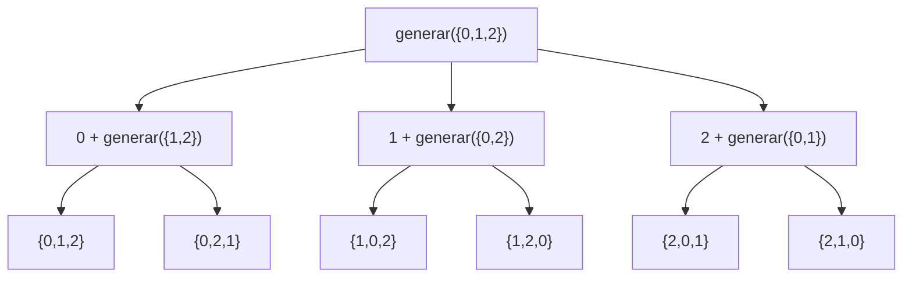

# Proyecto Final – Programación Funcional y Concurrente

## Informe 2

### Permutaciones y Optimización Secuencial

*Integrante:* Juan Camilo Velez Ospina 
*Código:* 2510206
*Correo:* juan.velez.ospina@correounivalle.edu.co

-----

# 1\. RESPONSABILIDADES

- Implementación de lógica combinatoria (generación de permutaciones).
- Integración de funciones de costo (Riego + Movilidad).
- Implementación del algoritmo de búsqueda del óptimo secuencial (`ProgramacionRiegoOptimo`).
- Argumentación de corrección sobre la exhaustividad del espacio de búsqueda.
- Creación de pruebas unitarias para validación de lógica de negocio.

-----

# 2\. FUNCIONES IMPLEMENTADAS

## 2.1 Generación de Programaciones

### `generarProgramacionesRiego(f: Finca): Vector[ProgRiego]`

Genera todas las posibles secuencias de riego para $n$ tablones.

- **Estrategia:** Recursión funcional.
- **Salida:** Un vector de tamaño $n!$ con todas las permutaciones de $\{0, \dots, n-1\}$.


```scala
def generarProgramacionesRiego(f: Finca): Vector[ProgRiego] = {
  val n = f.length
  val indices = Vector.range(0, n)

  // Función auxiliar
  def permutar(lista: Vector[Int]): Vector[Vector[Int]] = {
    if (lista.isEmpty) Vector(Vector())
    else {
      // Para cada elemento, lo fijamos y permutamos el resto
      lista.flatMap { elem =>
        permutar(lista.filter(_ != elem)).map(p => elem +: p)
      }
    }
  }
  permutar(indices)
}
```

-----

## 2.2 Búsqueda del Óptimo

### `ProgramacionRiegoOptimo(f, d): (ProgRiego, Int)`

Calcula la programación que minimiza la suma de costos.

- Genera el espacio de búsqueda completo.
- Evalúa $CostoTotal = CostoRiego + CostoMovilidad$.
- Selecciona el mínimo usando `minBy`.

-----

# 3\. PROCESO DE PERMUTACIÓN

La generación del espacio de soluciones se realiza mediante un árbol de recursión.

## 3.1 Diagrama de Flujo (Mermaid)



-----

# 4\. ARGUMENTO DE CORRECCIÓN (OPTIMIZACIÓN)

El problema se modela como la minimización de una función de costo sobre un conjunto discreto y finito de permutaciones $S_n$.

## 4.1 Formalización Matemática

La solución óptima $\Pi_{opt}$ se define como:

\[
\Pi_{opt} = \operatorname*{arg\,min}_{\Pi \in S_n} \left( CR_{F}^{\Pi} + CM_{F}^{\Pi} \right)
\]

## 4.2 Garantía de Solución

Este algotimo es correcto por os siguientes puntos:

1.  **Exhaustividad:** `generarProgramacionesRiego` construye todo el conjunto $S_n$ (cardinalidad $n!$).
2.  **Determinismo:** La evaluación de costos es determinista para cada $\Pi$.
3.  **Selección:** La función `minBy` recorre la totalidad de candidatos y garantiza retornar el elemento con el valor numérico más bajo.

No se utilizan heurísticas aproximadas; la solución es el **óptimo global exacto**.

-----

# 5\. PRUEBAS UNITARIAS

**TEST:** `PruebasIntegrante2.scala`

Se validaron 5 escenarios críticos:

- **Combinatoria (n=3):** Se generan exactamente $3! = 6$ permutaciones únicas.
- **Escalabilidad (n=4):** Se generan correctamente $4! = 24$ permutaciones.
- **Lógica de Supervivencia:** El algoritmo prioriza regar tablones con $ts$ crítico (ej. $ts=1$).
- **Lógica de Movilidad:** El algoritmo evita rutas con costos de distancia extremos (ej. evitar los caminos con costo 1000, para ahorrar).
- **Consistencia:** El costo reportado coincide exactamente con la suma manual de `costoRiego` + `costoMovilidad`.

Todas las pruebas pasaron correctamente