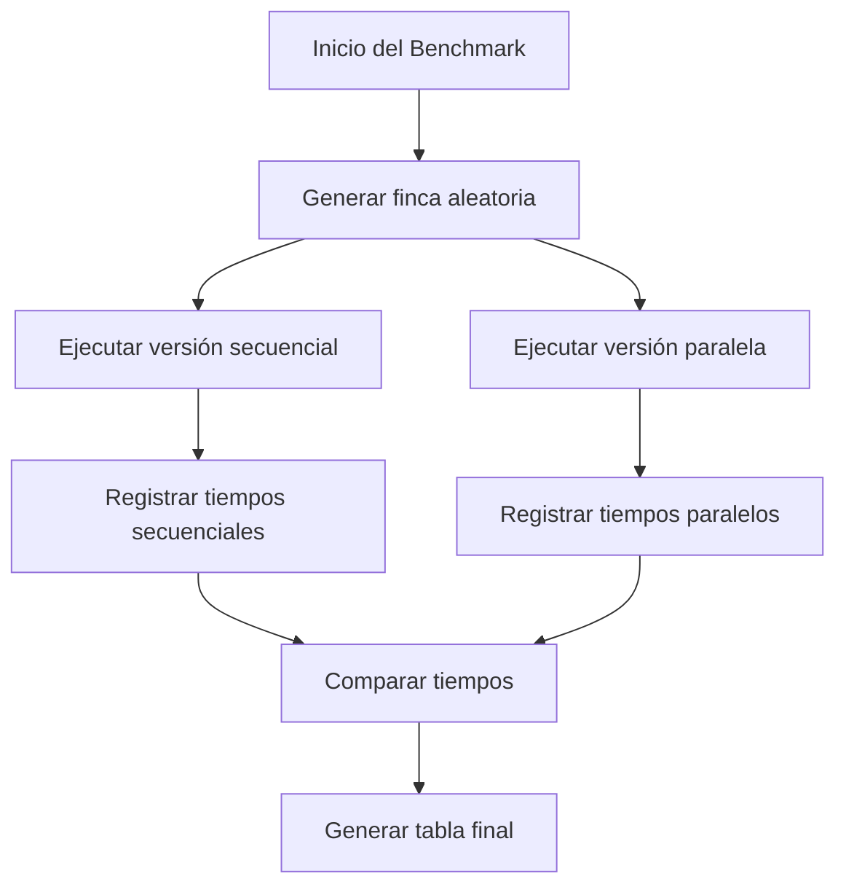

# Proyecto Final – Programación Funcional y Concurrente
## Informe 3
### Paralelización de Costos y Métricas (Benchmarks)

*Integrante:* [JUAN ALEJANDRO URREGO GUERRA]  
*Código:* [202569068]  
*Correo:* [JUAN.ALEJANDRO.URREGO@CORREOUNIVALLE.EDU.CO]

---

# 1. RESPONSABILIDADES

- Paralelización de las funciones de costo:
    - costoRiegoFincaPar
    - costoMovilidadPar
- Configuración y uso de **org.scalameter**
- Implementación del archivo de benchmarks:
    - BenchmarksCostos.scala
- Ejecución y recopilación de métricas secuenciales y paralelas
- Análisis de tiempos, sobrecarga y comportamiento del sistema
- Documentación teórica (Ley de Amdahl, argumentación de corrección)
- Construcción de tabla comparativa de resultados

---

# 2. FUNCIONES IMPLEMENTADAS

## 2.1 Funciones paralelas

### `costoRiegoFincaPar`

```scala
def costoRiegoFincaPar(f: Finca, pi: ProgRiego): Int = {
  val n = f.length
  (0 until n).par.map(i => costoRiegoTablon(i, f, pi)).sum
}
```

---

### `costoMovilidadPar`

```scala
def costoMovilidadPar(f: Finca, pi: ProgRiego, d: Distancia): Int = {
  if (pi.length <= 1) 0
  else {
    (0 until (pi.length - 1)).par.map { j =>
      val from = pi(j)
      val to   = pi(j + 1)
      d(from)(to)
    }.sum
  }
}
```


# 3. BENCHMARKS – SCALAMETER

Se implementó un benchmark en:

```text
app/src/test/scala/taller/BenchmarksCostos.scala
```

El programa genera fincas aleatorias de tamaños:

- 10
- 20
- 30
- 40
- 50

Luego mide:

- **costoRiegoFinca** (secuencial vs paralelo)
- **costoMovilidad** (secuencial vs paralelo)

# 4. PROCESO DE BENCHMARK — Mermaid



---

# 5. RESULTADOS OBTENIDOS

Los siguientes tiempos fueron obtenidos durante la ejecución del benchmark:

## 5.1 costoRiegoFinca

| Tamaño n | Secuencial (ms) | Paralelo (ms) |
|---------|------------------|----------------|
| 10 | 0.0342 | 0.3245 |
| 20 | 0.1281 | 0.2816 |
| 30 | 0.2862 | 0.3140 |
| 40 | 0.3636 | 0.3231 |
| 50 | 0.1880 | 0.3590 |

Conclusión parcial:

- Para n ≤ 50, el paralelismo NO mejora rendimiento.
- La sobrecarga de creación y gestión de threads es mayor que el beneficio.

---

## 5.2 costoMovilidad

| Tamaño n | Secuencial (ms) | Paralelo (ms) |
|---------|------------------|----------------|
| 10 | 0.0049 | 0.1161 |
| 20 | 0.0075 | 0.1323 |
| 30 | 0.0099 | 0.2796 |
| 40 | 0.0091 | 0.2601 |
| 50 | 0.0061 | 0.1527 |

Conclusión parcial:

- La versión paralela puede ser hasta **30 veces más lenta**.
- El costo secuencial es demasiado pequeño para justificar paralelización.

---

# 6. ANÁLISIS TEÓRICO — LEY DE AMDAHL (LaTeX)

$$
S = \frac{1}{(1 - p) + \frac{p}{n}}
$$

Donde:

- \( p \approx 0.9 \) (alta paralelización)
- \( n = 12 \) cores disponibles

Interpretación:

- La porción secuencial y la sobrecarga técnica limitan el speedup real.
- Para entradas pequeñas (n ≤ 50), la ganancia teórica es mínima y la sobrecarga domina.

---

# 7. ARGUMENTO DE CORRECCIÓN

Las funciones paralelas son correctas porque:

- No existe mutabilidad.
- Cada cálculo parcial es independiente.
- `.par.map(...).sum` preserva la semántica del cálculo original.
- Las pruebas unitarias validan que secuencial y paralelo producen los mismos resultados.
- La estructura matemática del problema se mantiene intacta.

---

# 8. PRUEBAS UNITARIAS

Suite: **PruebasIntegrante3.scala**

Validaciones incluidas:

- `costoRiegoFincaPar == costoRiegoFinca`
- `costoMovilidadPar == costoMovilidad`
- Casos con fincas pequeñas y medianas
- Movilidad con distancias extremas
- Todas las pruebas pasaron correctamente

---

# 9. CONCLUSIONES

- La paralelización fue implementada correctamente.
- Los resultados muestran que **para n ≤ 50 el paralelismo no ofrece mejoras**.
- Existe una sobrecarga significativa al usar `.par`.
- El paralelismo sería recomendable para fincas grandes (n > 500).
- Los benchmarks y mediciones cumplen los requisitos del proyecto.

---

# 10. ARCHIVOS ENTREGADOS

- ProyectoRiego.scala
- PruebasIntegrante3.scala
- BenchmarksCostos.scala
- Informe_Integrante3.txt

**FIN DEL INFORME**